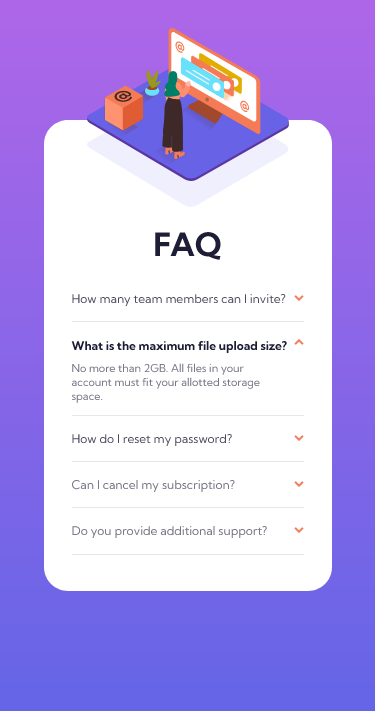
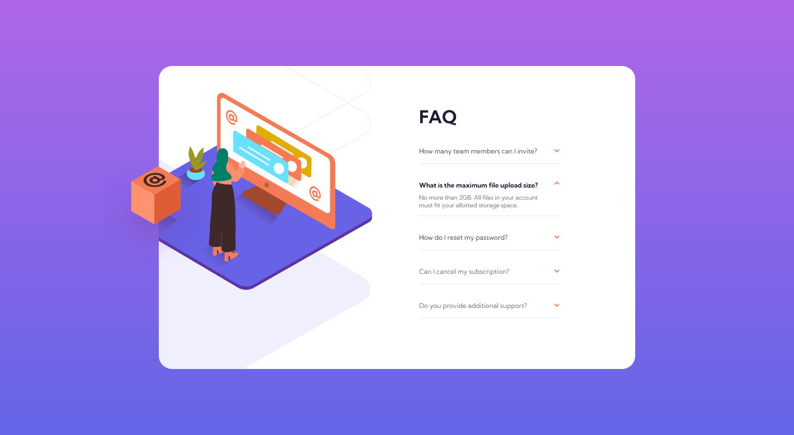

# Frontend Mentor - FAQ accordion card solution

## Welcome! 👋

Thanks for checking out my solution to this front-end coding challenge.

This is a solution to the [FAQ accordion card challenge on Frontend Mentor](https://www.frontendmentor.io/challenges/faq-accordion-card-XlyjD0Oam). Frontend Mentor challenges help you improve your coding skills by building realistic projects. 


## Table of contents

- [Overview](#overview)
  - [The challenge](#the-challenge)
  - [Screenshots](#screenshots)
  - [Links](#links)
- [My process](#my-process)
  - [Built with](#built-with)
  - [What I learned](#what-i-learned)
- [Author](#author)


## Overview

### The challenge

Users should be able to:

- View the optimal layout for the component depending on their device's screen size
- See hover states for all interactive elements on the page
- Hide/Show the answer to a question when the question is clicked

### Screenshots





### Links

- Solution URL: [https://github.com/Tauya2003/faq-accordion-card-FM](https://github.com/Tauya2003/faq-accordion-card-FM)
- Live Site URL: [Add live site URL here](https://your-live-site-url.com)

## My process

### Built with

- Semantic HTML5 markup
- CSS custom properties
- Flexbox
- CSS Grid
- Mobile-first workflow
- [Sass](https://sass-lang.com/) - CSS pre-processor

### What I learned

```scss
$font-weights: (
    "regular": 400,
    "bold": 700
);

@function weight($weight){
    @return map-get($font-weights, $iweight)
};
```


## Author

- Github - [Tauya2003](https://github.com/Tauya2003)
- Frontend Mentor - [@Tauya2003](https://www.frontendmentor.io/profile/Tauya2003)
- Twitter - [@ayuat2003](https://www.twitter.com/ayuat2003)
